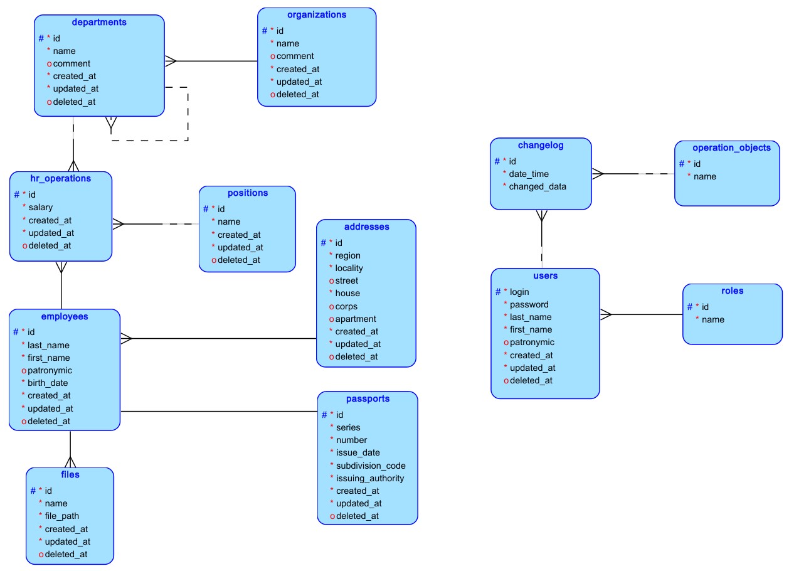
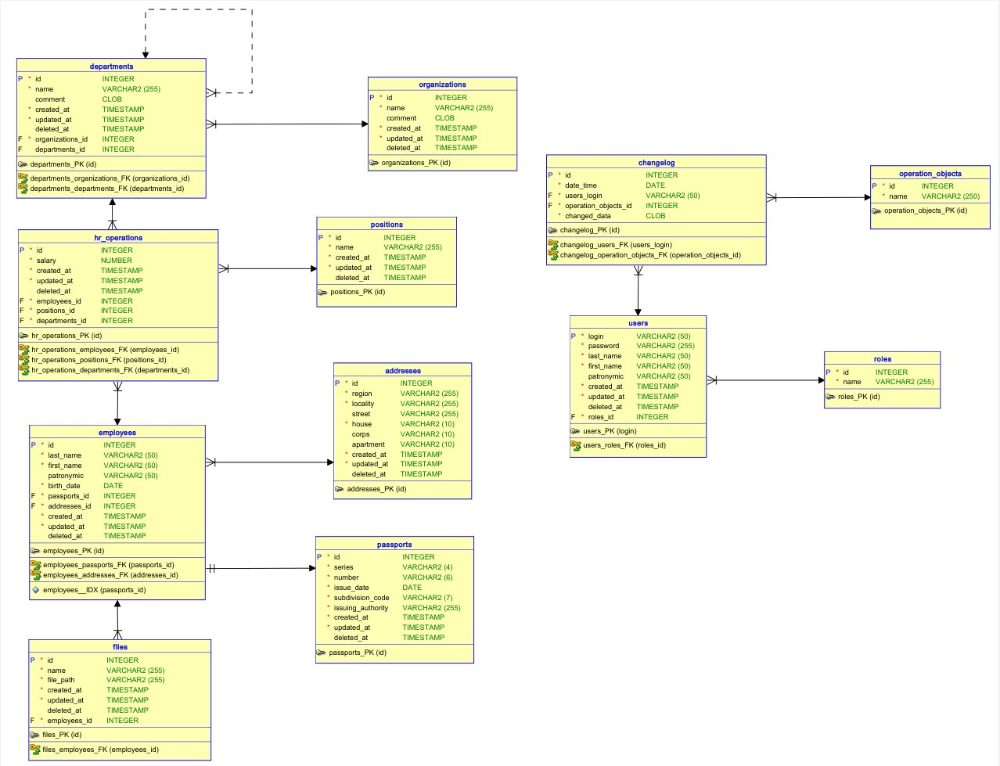

## Используемые инструменты
**Операционная система:** Windows 10 с установленным Docker Desktop  
**IDE:** ~~Visual Studio Code~~ WebStorm  
**СУБД:** PostgreSQL 18, установленный в ОС

## Используемые команды Git
* `git status` - посмотреть изменённые файлы
* `git add .` - добавить все изменённые файлы в коммит
* `git commit -m "сообщение"` - создать коммит
* `git push origin master` - отправить коммит/-ы на удалённый репозиторий

## Схема БД
  
  
**Примечание:** тип `CLOB` в Oracle соответствует типу `TEXT` в PostgreSQL